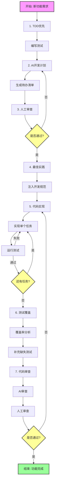

+++
title = "AI编程最佳实践：人机协作的结构化框架"
date = 2024-03-21
description = "一份全面的AI辅助编程工作流程指南。学习如何通过结构化方法在保持控制权的同时充分利用AI的能力，结合TDD、最佳实践注入和系统化审查流程。"

[taxonomies]
tags = ["AI", "Architecture", "DevOps", "中文"]

[extra]
show_comments = true
banner = "https://images.unsplash.com/photo-1620712943543-bcc4688e7485?q=80&w=2940&auto=format&fit=crop"
+++

> "编程的未来不是取代开发者，而是增强他们的能力。关键在于建立一个框架，让人类保持控制权的同时充分利用AI的优势。"

GitHub Copilot和ChatGPT等AI编程助手的崛起在开发社区引发了既兴奋又担忧的讨论。虽然这些工具能显著加快编码速度，但如果没有结构化的使用方法，可能导致架构混乱、代码质量不一致，以及项目控制权的丧失。

本文提出了一个系统化的人机协作框架，确保你在最大化利用AI潜力的同时保持对架构的控制。

## 框架概览



## 挑战：为什么AI编程需要结构化方法

不受控制的AI编程助手常常导致以下问题：

1. **偏离业务目标**：AI可能过度优化代码优雅性而忽视业务需求
2. **架构不一致**：生成的代码可能与项目规范不符
3. **测试覆盖不足**：关键边界情况和错误处理常被忽略
4. **失去控制权**：人机责任边界模糊不清

## 受控的AI协作框架

让我们探索一个能解决这些挑战同时最大化AI优势的结构化方法。

### 1. 测试驱动开发（TDD）优先

在实现之前先写测试。这种方法：
- 为你和AI明确需求
- 确保可验证的结果
- 保持对业务逻辑的关注

AI提示示例：
```
根据以下RSpec测试，实现Rails控制器逻辑：

describe UsersController do
  describe 'POST #create' do
    it '使用有效参数创建新用户' do
      # 测试代码
    end
  end
end
```

### 2. AI生成开发计划

让AI在实现之前创建结构化的待办事项清单：
- 将功能分解为离散任务
- 识别依赖关系和组件
- 规划实现顺序

提示示例：
```
基于这个功能描述，创建一个待办事项清单，包括：
- 需要的类/模块
- 函数签名
- 数据库变更
- API端点
暂时不要写代码 - 等待我的审查。
```

### 3. 人工审查和批准

审查并修改AI的计划：
- 与架构愿景对齐
- 移除不必要的组件
- 确认实现方案
- 设定清晰的边界

这一步对于保持项目方向的控制至关重要。

### 4. 注入最佳实践和约定

在开始编码之前，明确提供：
- 项目编码标准
- 框架约定
- 架构模式
- 目录结构
- 命名约定
- 授权模式

提示示例：
```
你是一位精通Rails的高级工程师，熟悉：
- Service对象模式
- 基于策略的授权
- dry-rb gems
请遵循这些约定：
[列出约定]
```

### 5. 增量实现

一次实现一个任务：
- 为单个组件生成代码
- 立即运行测试
- 必要时讨论设计决策
- 保持持续反馈循环

### 6. AI辅助测试覆盖

使用AI增强测试覆盖：
- 运行覆盖率工具（SimpleCov、pytest-cov）
- 为未覆盖的路径生成测试
- 确保处理边界情况

提示示例：
```
这是SimpleCov报告显示的未覆盖行。
为这些场景生成适当的测试：
[未覆盖的场景]
```

### 7. 双层代码审查

实施两阶段审查流程：
1. AI审查：
   - 检查命名约定
   - 识别代码异味
   - 发现潜在bug
   - 建议重构机会

2. 人工审查：
   - 验证业务逻辑
   - 确保架构一致性
   - 最终批准和合并

## 控制矩阵：人机职责

| 阶段 | 人类主导 | AI协助 |
|------|---------|--------|
| 编写提示 | ✅ | |
| 生成待办事项 | | ✅ |
| 计划审查 | ✅ | |
| 最佳实践输入 | ✅ | |
| 实现 | ✅ (控制) | ✅ (执行) |
| 测试增强 | ✅ | ✅ |
| 覆盖率审查 | ✅ | ✅ |
| 初步代码审查 | | ✅ |
| 最终审查 | ✅ | |

## 框架优势

1. **保持控制**：人类驱动架构决策和项目方向
2. **一致的质量**：标准化方法确保可靠输出
3. **高效协作**：清晰的边界最大化人机优势
4. **全面的测试**：结构化的质量保证方法
5. **可扩展流程**：框架适应不同项目规模和技术

## 实施建议

1. **记录你的框架**：创建团队AI协作指南
2. **从小开始**：从小功能开始完善流程
3. **迭代改进**：基于团队反馈调整框架
4. **跟踪指标**：监控对开发速度和代码质量的影响
5. **分享经验**：记录成功的提示和模式

## 结论

成功的AI辅助开发不仅仅是拥有强大的工具，更重要的是有一个能在利用AI能力的同时保持人类控制的结构化框架。这种方法确保AI保持助手角色而不是主导者，产出的代码能够与你的项目架构和业务目标保持一致。

记住：AI应该增强你的开发过程，而不是取代你的架构判断。有了这个框架，你可以自信地将AI工具整合到工作流程中，同时保持对代码库质量和方向的控制。 