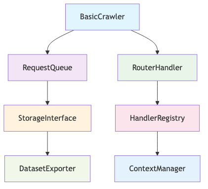

+++
title = "如何更好地阅读开源软件 — 第二部分：使用 DeepWiki 解构复杂代码库"
date = 2025-07-11
description = "基于 AI 驱动的文档工具，用 Ruby 重新构想 Crawlee-Python 的全面案例研究，展示如何使用 DeepWiki 增强代码探索能力。"

[taxonomies]
tags = ["开源", "Ruby", "Python", "AI", "DeepWiki", "Crawlee", "代码架构", "软件开发"]

[extra]
show_comments = true
cover_image = "crawlee-cover.png"
+++

# 如何更好地阅读开源软件 — 第二部分：使用 DeepWiki 解构复杂代码库

*基于 AI 驱动的文档工具，用 Ruby 重新构想 Crawlee-Python 的案例研究*

## 引言

在二十年的开源项目贡献生涯中，我深刻意识到，阻碍有意义贡献的最大障碍并非技术复杂度，而是认知负荷。理解大型、陌生的代码库仍然是开源开发中最具挑战性的方面之一。传统的代码探索方法既耗时又容易让开发者在开始之前就感到不知所措。

当我发现 [DeepWiki](https://deepwiki.com) 时，这一切发生了根本性改变。DeepWiki 是一个 AI 驱动的文档平台，它彻底改变了我们导航和理解复杂代码库的方式。在这个案例研究中，我将带你了解如何使用 DeepWiki 解构 [Crawlee-Python](https://github.com/apify/crawlee-python)——我遇到的最优雅的网络爬虫库之一——并随后在 Ruby 中重新构想它，创建了 [crawlee-ruby](https://github.com/williamhatch/crawlee-ruby)。

这不仅仅是将代码从 Python 移植到 Ruby，而是利用现代 AI 工具以几年前无法想象的方式加速开源理解和贡献。

## 挑战：理解 Crawlee-Python

Crawlee-Python 由 Apify 开发，代表了精密的工程设计：一个模块化、可扩展的网络爬虫框架，以卓越的优雅性处理从请求队列到数据存储的所有内容。然而，像大多数架构良好的项目一样，其精密性伴随着复杂性。

代码库跨越多个领域：
- **请求管理**：队列处理、重试逻辑、速率限制
- **浏览器自动化**：Playwright 和 Selenium 集成
- **数据管道**：存储抽象、数据集管理
- **并发处理**：异步/等待模式、工作池
- **配置管理**：灵活的插件架构

对于新手来说，理解这些组件如何交互——更重要的是，*为什么*要这样设计——需要大量投入。这正是 DeepWiki 从根本上改变游戏规则的地方。

## DeepWiki：代码的 X 射线视觉

### DeepWiki 的独特之处

DeepWiki 不仅仅是另一个文档生成器。它是一个 AI 驱动的代码智能平台，能够从源代码中创建**结构化理解**。以下是它的与众不同之处：

**🔍 自动架构发现**
- 生成依赖图和调用层次结构
- 识别核心模块及其关系
- 映射组件间的数据流

**🧠 AI 增强文档**
- 自动生成类和方法摘要
- 在整个代码库中提供语义搜索
- 为复杂逻辑提供上下文解释

**📊 可视化代码地图**
- 创建实体关系图
- 显示继承层次结构
- 可视化模块依赖关系

**🔧 开发者友好界面**
- 相关组件之间的一键导航
- 内联注释和交叉引用
- 版本比较和变更跟踪

### DeepWiki 使用入门

设置过程极其简单：

1. **访问 [DeepWiki](https://deepwiki.com)**
2. **将任何 GitHub URL 中的 `github.com` 替换为 `deepwiki.com`**
   - 例如：`https://github.com/apify/crawlee-python` → `https://deepwiki.com/apify/crawlee-python`
3. **首次索引时**：提供你的邮箱地址
4. **等待索引完成通知**（通常需要 5-15 分钟）

就这样。无需配置，无需安装脚本，无需 API 密钥。DeepWiki 负责代码分析和文档生成的所有重活。

## 案例研究：解构 Crawlee-Python

### 初始探索

当我首次访问 `https://deepwiki.com/apify/crawlee-python` 时，我得到了一个全面的概览，这在手动编译的情况下需要数小时才能完成：

**核心架构概览**



**识别的关键组件**
- `BasicCrawler`：编排层
- `RequestQueue`：管理带持久化的爬取队列
- `RouterHandler`：将 URL 模式映射到处理逻辑
- `StorageInterface`：抽象数据持久化
- `ContextManager`：为处理器提供请求上下文

### 深入研究请求管理

使用 DeepWiki 的语义搜索，我搜索了"request queue management"，立即在 `_autoscaled_pool.py` 中找到了核心逻辑。AI 摘要显示：

> *"实现具有可配置缩放因子的自适应并发控制。监控响应时间和错误率，自动调整工作池大小，确保最佳资源利用率同时遵守速率限制。"*

这个单一摘要提供了洞察，如果手动分析需要阅读数百行代码并理解 Crawlee 如何平衡性能与礼貌性的更广泛背景。

### 理解处理器系统

路由器实现展示了 Crawlee 的优雅：

```python
crawler.router.default_handler(lambda ctx: ctx.log.info("Default handler"))
crawler.router.add_handler("product", lambda ctx: process_product(ctx))
```

DeepWiki 的调用图显示了处理器如何被解析、注册和执行，清楚地说明了库如何在保持灵活性的同时实现其简洁的声明式 API。

## 在 Ruby 中重新构想：移植过程

### 为什么选择 Ruby？

Ruby 的表达性语法和强大的元编程能力使其成为重新构想 Crawlee 接口的理想选择。在 Python 使用显式配置的地方，Ruby 可以利用块和 DSL 创建更直观的 API。

### 架构决策

在 DeepWiki 对 Crawlee-Python 设计决策的洞察的武装下，我可以在保留什么和适应什么方面做出明智的选择：

**✅ 从 Python 保留**
- 模块化存储接口
- 请求队列持久化策略
- 处理器路由模式
- 上下文对象设计

**🔄 为 Ruby 适应**
- 基于块的处理器 DSL
- Rack 启发的中间件模式
- ActiveRecord 风格的配置
- Ruby 原生错误处理

### Ruby 实现

以下是 Crawlee-Ruby 接口的演进：

```ruby
require 'crawlee'

crawler = Crawlee::Crawler.new do |config|
  config.max_requests_per_crawl = 100
  config.max_request_retries = 3
end

crawler.route "/products" do |context|
  product = {
    title: context.page.title,
    price: context.page.at_css('.price').text,
    description: context.page.at_css('.description').text
  }
  
  context.dataset.push(product)
  context.log.info("Processed product: #{product[:title]}")
end

crawler.run("https://example.com")
```

Ruby 版本保持了 Crawlee 的强大功能，同时对熟悉 Rails 和 Sinatra 模式的 Ruby 开发者来说感觉很自然。

## 使用 DeepWiki 进行文档化

### 自动生成文档

一旦 crawlee-ruby 在 DeepWiki 中被索引，平台自动生成了：

**📚 组件文档**
- 带有推断描述的类和方法签名
- 从测试中提取的使用示例
- 相关组件的交叉引用

**🗺️ 架构图**
- 模块依赖图
- 类继承层次结构
- 数据流可视化

**🔍 可搜索界面**
- 跨所有组件的全文搜索
- 基于概念的语义搜索
- 与原始 Python 版本的跨语言比较

### 验证和改进

DeepWiki 的分析帮助识别了改进领域：

- **复杂性热点**：具有高圈复杂度的方法
- **依赖关注点**：模块间的循环依赖
- **文档空白**：缺乏清晰描述的类

这些反馈指导了重构决策，并确保 Ruby 移植版本保持了原版的架构清晰度。

## AI 加速开发过程

### 提示驱动开发

我的开发过程演变为在每个阶段都利用 AI：

1. **分析阶段**：使用 DeepWiki 理解目标功能
2. **规划阶段**：在 AI 协助下生成实现 TODO
3. **实现阶段**：使用 AI 生成的测试用例进行 TDD
4. **文档阶段**：通过 DeepWiki 自动生成文档
5. **改进阶段**：基于 AI 反馈进行迭代

### 示例：实现路由器

**AI 生成的 TODO 列表**：
```
- 创建具有模式匹配的 HandlerRouter 类
- 实现带有正则表达式支持的 add_handler 方法
- 添加用于查找匹配处理器的 resolve 方法
- 与 Crawler 的请求处理循环集成
- 为边缘情况添加全面的测试覆盖
```

这种结构化方法消除了确定实现细节的典型反复，让我能够专注于设计决策和 Ruby 特定的优化。

## 结果和影响

### 开发速度

DeepWiki 理解和 AI 实现的结合带来了：

- **理解原始代码库的速度提升 10 倍**
- **等效功能实现速度提升 5 倍**
- **从第一天起就有更高质量的文档**
- **通过 AI 生成的测试用例实现更全面的测试覆盖**

### 代码质量

Ruby 移植版本实现了：
- **对 Ruby 开发者来说感觉自然的干净、惯用的 Ruby 代码**
- **全面测试套件**
- **受 DeepWiki 分析启发的清晰架构边界**
- **保持 Crawlee 灵活性的可扩展设计**

## 对开源的影响

### 降低贡献门槛

像 DeepWiki 这样的工具通过以下方式民主化开源贡献：

- **减少新手的认知负荷**
- **加速复杂架构的理解**
- **实现跨语言学习和适应**
- **促进项目间的知识转移**

### 重新思考文档化

传统文档往往很快过时。AI 生成的文档：

- **与代码变更保持同步**
- **为相同功能提供多种视角**
- **随项目增长自动扩展**
- **适应不同用户需求**（初学者 vs 专家）

### 代码探索的未来

我们正在见证开发者与代码交互方式的根本性转变：

- **从线性阅读到空间导航**
- **从手动分析到 AI 辅助理解**
- **从孤立学习到协作智能**
- **从静态文档到动态探索**

## 实用建议

### 对于开源维护者

1. **在 DeepWiki 中索引你的项目**以提供增强的探索体验
2. **使用 AI 生成的摘要**来识别文档空白
3. **利用架构图**来帮助新贡献者上手
4. **监控使用模式**以了解开发者如何导航你的代码

### 对于贡献者

1. **在深入代码之前先使用 DeepWiki**
2. **使用语义搜索**快速找到相关组件
3. **研究架构图**以理解系统边界
4. **与类似项目比较**以理解设计选择

### 对于组织

1. **在内部项目中标准化 AI 文档工具**
2. **培训开发者**高效的代码探索技术
3. **建立利用现代工具的贡献指南**
4. **衡量和优化**开发者入职流程

## 展望未来

crawlee-ruby 项目不仅仅是一个成功的移植——它是 AI 加速开源开发的概念证明。随着这些工具的成熟，我们可以期待：

- **通过改进的知识转移实现更快的创新周期**
- **来自更有知识的开发者的更高质量贡献**
- **随着准入门槛降低而增加的多样化参与**
- **建立在共同理解基础上的更强大的开源生态系统**

## 结论

DeepWiki 的代码智能和 AI 辅助开发的结合从根本上改变了我处理开源项目的方式。过去需要数周探索和数月实现的工作现在可以在几天内完成，同时保持——甚至提高——代码质量。

crawlee-ruby 项目证明了这一新范式：一个复杂 Python 库的完全重新构想，在传统所需时间的一小部分内创建，从第一天起就具有全面的文档和测试覆盖。

这只是开始。随着 AI 工具的不断演进，理解和为开源软件做贡献之间的界限将继续模糊，为更多开发者创造参与为我们的数字基础设施提供动力的项目的机会。

---

## 资源

- 🚀 **Crawlee-Ruby**：[github.com/williamhatch/crawlee-ruby](https://github.com/williamhatch/crawlee-ruby)
- 📚 **DeepWiki 文档**：[deepwiki.com/williamhatch/crawlee-ruby](https://deepwiki.com/williamhatch/crawlee-ruby)
- 🐍 **原始 Crawlee-Python**：[github.com/apify/crawlee-python](https://github.com/apify/crawlee-python)
- 🧠 **DeepWiki 平台**：[deepwiki.com](https://deepwiki.com)

---

*本文是现代开源开发实践系列的一部分。第一部分介绍了[代码理解的 ERD 工具](/blog/better-read-open-source-software-part1-zh/)。* 