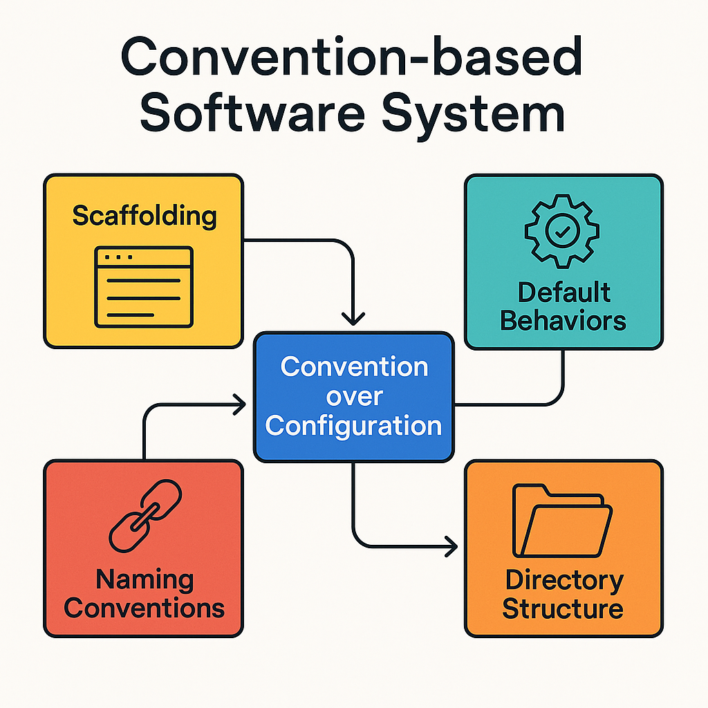

# 约定优于配置：从资深架构师视角解读现代软件设计



## 1. 为什么我们需要 CoC？从配置驱动到架构哲学

早期的 Java EE 时代，企业开发者需要大量手工编写 XML 来描述系统结构：

- **重复声明**：每个 bean、controller、service 都需手动配置
- **关注点错位**：配置逻辑和实现逻辑分离
- **学习曲线陡峭**：理解项目等于解析配置文件森林

如果 90% 的项目结构类似，为什么不直接通过结构约定自动生成？这正是 CoC 的初衷。

## 2. CoC 的定义与核心理念

> “不要为框架能够推断的内容写配置。” —— DHH（Rails 之父）

核心思想：

- 提供**合理的默认行为**
- 通过**命名与目录结构约定**完成自动配置
- 只需对“例外情况”进行显式配置

## 3. 主流框架中的 CoC 实现

| 框架       | CoC 展现形式                  | 常用工具             |
|------------|-------------------------------|----------------------|
| Rails      | 基于目录结构自动加载          | `rails generate scaffold` |
| Spring Boot| 注解 + Classpath 自动装配     | `@ComponentScan` 等     |
| Django     | App 模块化 + 命名约定          | `startapp`, `urls.py` |
| Laravel    | 控制器 + 路由资源化            | `artisan make:controller` |
| NestJS     | 装饰器 + 模块结构              | `@Controller`, `@Module()` |

这些框架都在通过“结构约定”统一开发体验，使开发者关注业务逻辑。

## 4. 从框架技巧到工程哲学

CoC 并不是语法糖，而是**工程抽象**的重要体现。

- **统一代码风格**：避免无意义的自由
- **降低认知负担**：减少重复选择
- **提升协作效率**：新成员快速理解项目结构
- **易于迁移与演进**：架构升级更可控

## 5. 架构图与流程图


此图展示了现代框架如何整合：

- 默认行为
- 文件结构
- 命名规范
- 模块注入方式

...统一为一体的约定式架构系统。

## 6. CoC 在 DevOps 与微服务中的作用

DevOps 工具也普遍使用约定：

- **Terraform**：变量命名规范、文件分层
- **Kubernetes**：YAML 结构、标签匹配、资源命名
- **CI/CD**：如 `.github/workflows/`、`Jenkinsfile` 的默认路径

CoC 是 DevOps 能够扩展与模块化的基础。

## 7. 代码迁移的桥梁：技术是可以迁移的

一旦掌握 CoC 架构方式，从 Rails 到 NestJS、Laravel 并不难。示例：

```typescript
// NestJS
@Controller('posts')
export class PostController {
  @Get(':id')
  async show(@Param('id') id: string) {
    return this.postService.findOne(id);
  }
}
```

```php
// Laravel
public function show($id) {
  $post = Post::find($id);
  return view('posts.show', compact('post'));
}
```

```ruby
# Rails
def show
  @post = Post.find(params[:id])
end
```

✨ 结构、命名、路由方式完全一致。掌握一套结构模型，语言只是工具。

## 8. AI、自动化与 CoC 的新演化

即使在 AI 工程与 MLOps 中：

- 文件结构约定：`data/`, `model/`, `train.py`, `inference.py`
- 工具约定：MLflow, Kubeflow 等都依赖默认路径
- Prompt 编程：模型根据结构提示生成代码

结构决定生成结果，CoC 在 AI 编程中价值更大。

## 9. 总结：CoC 是现代架构的通用语言

CoC 已成为：

- 软件工程师的共同认知
- 架构设计的基础规则
- 多语言迁移的桥梁
- 软件自动化与团队协作的核心

> “约定是送给团队未来成员的一份礼物。”

---

*作者：资深架构师 / 平台工程专家*
