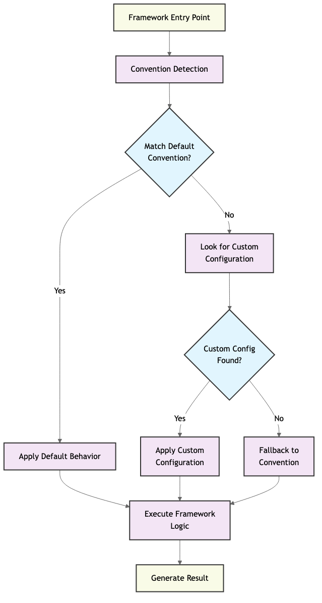

# Convention over Configuration: A Senior Architect’s Perspective on Modern Software Design


## 1. Why We Need CoC: The Pain of Early Configuration-Driven Systems

In the early Java EE days, enterprise developers spent countless hours writing XML just to describe what the application should already know...

- **Over-declaration**: every bean, service, and controller had to be manually wired.
- **Separation of concerns gone wrong**: configuration scattered outside implementation.
- **Cognitive overhead**: understanding the system meant parsing endless files.

If 90% of projects follow a similar structure, why not standardize it?

This is the exact problem CoC solves.

## 2. What Is Convention over Configuration?

> “Don’t write configuration for things the framework can figure out.” — DHH, creator of Ruby on Rails

The idea is simple:

- Prefer **sensible defaults** over explicit setup.
- Encourage **implicit structure** through file naming and organization.
- Let developers focus on what’s different, not on repeating boilerplate.

## 3. CoC Across Languages and Frameworks

| Framework     | CoC in Action                          | Tooling           |
|---------------|----------------------------------------|-------------------|
| Rails         | Folder-based MVC, no route config      | `rails generate scaffold` |
| Spring Boot   | Autowiring, annotations over XML       | `@ComponentScan` etc.     |
| Django        | App naming, admin auto discovery       | `startapp`, `urls.py`     |
| Laravel       | Controller + Resource Route bindings   | `artisan make:controller` |
| NestJS        | Module structure + Decorator syntax    | `@Controller`, `@Module()` |

These frameworks adopt the same mental model — directory structure, naming rules, default lifecycles.

## 4. CoC as an Engineering Doctrine

CoC is not just a DX (Developer Experience) trick — it’s an engineering design strategy.

**Good architecture is invisible.**  
It guides teams without needing to be constantly enforced. CoC helps in:

- **Code consistency across teams**
- **Reduced onboarding time**
- **Minimized error surface**
- **Automated tooling compatibility**

## 5. Architecture Visualization



This diagram illustrates how modern frameworks integrate:

- Scaffolding
- Default behaviors
- Naming conventions
- Directory layout

...into a unified, opinionated software system.

## 6. CoC in DevOps and Microservices

Convention-driven tools like:

- **Terraform**: Directory layout & variable naming
- **Kubernetes YAML**: Label selectors, config maps
- **CI/CD**: `.github/workflows/`, `Jenkinsfile`, etc.

All rely on shared conventions. As environments scale, conventions become guardrails.

## 7. Code Portability Enabled by CoC

Once you understand Rails, you’ll pick up Laravel or NestJS quickly — because CoC abstracts language differences.

```typescript
// NestJS
@Controller('posts')
export class PostController {
  @Get(':id')
  async show(@Param('id') id: string) {
    return this.postService.findOne(id);
  }
}
```

```php
// Laravel
public function show($id) {
  $post = Post::find($id);
  return view('posts.show', compact('post'));
}
```

```ruby
# Rails
def show
  @post = Post.find(params[:id])
end
```

## 8. AI, Automation & Future of CoC

Even modern AI workflows adopt CoC:

- `data/`, `model/`, `train.py`, `inference.py` — this is a de facto convention
- MLflow and Kubeflow pipelines follow predictable directory and module conventions
- Prompt-based coding (Copilot / GPT) relies heavily on knowing the **structure**

This shows CoC is not obsolete — it is evolving.

## 9. Final Thoughts

CoC is not a limitation — it’s a **productivity enabler**.

- It minimizes choices that don’t matter.
- It promotes clarity, collaboration, and growth.
- It enables rapid transfer of skills across ecosystems.

> "Conventions are a gift to your future team."

---

*Written by a Senior Software Architect & Platform Engineer*
